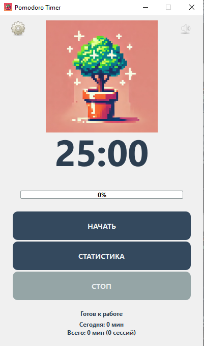

# Pomodoro Timer

Удобный таймер для техники Pomodoro с настраиваемыми интервалами работы и отдыха, статистикой и уведомлениями.

## 🚀 Возможности

- Настраиваемые интервалы работы и отдыха
- Статистика по дням и сессиям
- Звуковые уведомления
- Стильный ретро-интерфейс в стиле Windows XP
- Автоматическое сохранение прогресса

## 💻 Системные требования

- Windows XP или новее
- 500 МБ свободного места на диске
- Разрешение экрана 1024x768 или выше

## 📥 Установка

1. Скачайте последнюю версию приложения из раздела [Releases](https://github.com/Chealsea10/pomodoro-timer/releases)
2. Распакуйте архив в удобное место на вашем компьютере
3. Запустите `Pomodoro Timer.exe` из распакованной папки (my_pomodoro_timer\dist\Pomodoro Timer\Pomodoro Timer.exe)

*Примечание: При первом запуске Windows может показать предупреждение безопасности. Это нормально, так как приложение не имеет цифровой подписи. Нажмите "Дополнительно" → "Выполнить в любом случае".*

## 🎯 Использование

1. **Запуск таймера**
   - Нажмите кнопку "Начать" для старта рабочей сессии
   - По умолчанию: 25 минут работы, 5 минут короткий перерыв

2. **Управление**
   - "Пауза" - приостановить таймер
   - "Продолжить" - возобновить отсчет
   - "Стоп" - сбросить таймер

3. **Звук**
   - Нажмите на иконку звука в правом верхнем углу для включения/выключения уведомлений

## ⚙️ Настройка

1. Нажмите на иконку настроек в левом верхнем углу
2. В открывшемся окне вы можете настроить:
   - Время работы (1-60 минут)
   - Время короткого перерыва (1-30 минут)
   - Время длинного перерыва (1-60 минут)
   - Количество рабочих сессий до длинного перерыва (1-10)
3. Нажмите "Сохранить" для применения настроек

## 📊 Статистика

- Нажмите кнопку "Статистика" для просмотра:
  - Времени работы за сегодня
  - Общего количества завершенных сессий
  - Подробной статистики по дням

## ❓ Решение проблем

1. **Приложение не запускается**
   - Убедитесь, что все файлы из архива распакованы в одну папку
   - Проверьте, что у вас есть права на запуск приложений в этой папке
   - Попробуйте запустить от имени администратора

2. **Нет звука уведомлений**
   - Проверьте, включен ли звук в приложении (иконка в правом верхнем углу)
   - Проверьте громкость системы
   - Убедитесь, что звуковое устройство работает корректно

3. **Статистика не сохраняется**
   - Проверьте права на запись в папку с приложением
   - Попробуйте запустить приложение от имени администратора

## 🤝 Поддержка

Если у вас возникли проблемы или есть предложения по улучшению приложения:
1. Создайте issue в репозитории проекта
2. Опишите проблему или предложение
3. Приложите скриншот, если это поможет объяснить проблему

## 📝 Лицензия

MIT License - используйте свободно для любых целей.
